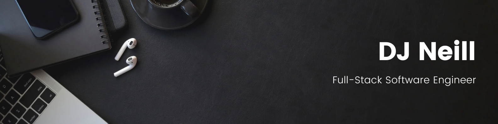
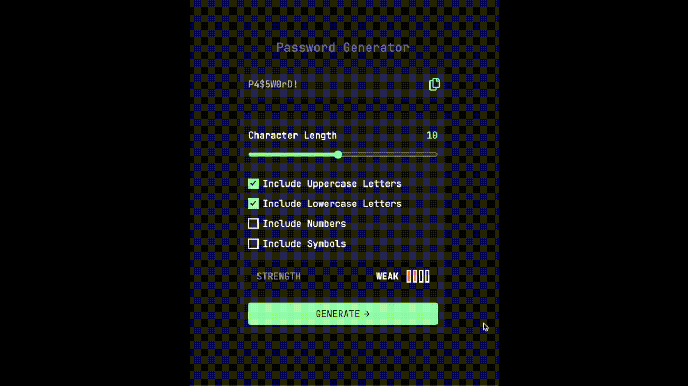
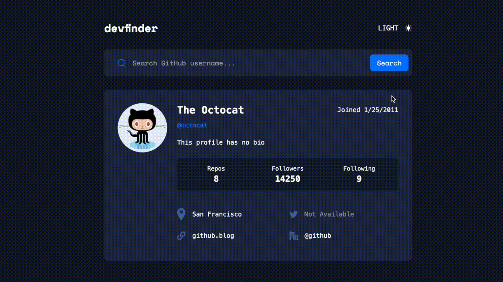

    <!-- <h1 align="center">Hi 👋, I'm DJ Neill</h1>
    <h3 align="center">A passionate Full Stack Engineer from Texas</h3> -->
    

  
  
  
  
  

  

  

  

-👨‍💻 View my portfolio page at <a href="https://djneill.com/">djneill.com</a>

-📄 Know about my experiences <a href="images/GH Resume.pdf">Resume</a>

<h3 align="center">Connect with me:</h3>
    

        
        
    

<h3 align="center">Languages:</h3>

  

<h3 align="center">Frameworks:</h3>

  

<h3 align="center">Libraries:</h3>

  

<h3 align="center">Databases:</h3>

  

<h3 align="center">Tools:</h3>

  

    
<h1 align="center">Projects</h1>
<table bordercolor="#66b2b2">

<tr>
<td width="50%" valign="top">
    <h3 align="center">djneill.com</h3>
     
     
     
    

        
    

     
<strong>Javascript, React.js, Next.js, Tailwind CSS, Netlify</strong> - Portfolio page with projects and a contact form
                    to get in touch.

</td>

<td width="50%" align="center" valign="top">
    <h3 align="center">Let's Cook</h3>
     
     
     
    

        
    

    
<strong>EJS, CSS3, Tailwind CSS, Javascript, Node.js, Express, MongoDB, Mongoose, Passport.js, MVC paradigm</strong> - Let's Cook is a full-stack web app where users can post their favorite recipes, search for new recipes, and save their favorite recipes to a collection that they can easily find.

</td>
        </tr>

<tr>
            <td width="50%" valign="top">
                <h3 align="center">Password Generator</h3>
                 
                
                 
                

                    
                    
                

                
<strong>Typescript, Next.js, React, and Tailwind CSS</strong> - This project is a web-based password generator, it allows users to generate secure passwords with customizable options.
                

            </td>

<td width="50%" valign="top">
                <h3 align="center">Dev Search</h3>
                 
                
                 
                

                    
                

                
<strong>Typescript, Next.js, React, Tailwind CSS, GitHub API</strong> - Dev Search is a web application that allows users to search for GitHub profiles and view detailed information about developers. Users can search for any GitHub username, view their profile information, and toggle between light and dark themes.

            </td>
        </tr>

<tr>

<td width="50%" valign="top">
                <h3 align="center">Git 'er Done Pomodoro List</h3>
                 
                
                 
                

                    
                    
                

                
<strong>HTML5, CSS3, EJS, Javascript, Bootstrap, Font Awesome, Node.js, Express, Passport.js, MongoDB, Mongoose, MVC paradigm</strong> - Todo Task List with an integrated Pomodoro timer.
                

            </td>

<td width="50%" valign="top">
                <h3 align="center">Gemini Coding Buddy</h3>
                 
                
                 
                

                    
                

                
<strong>React, Tailwind CSS, Typescript, Node.js, Express.js, React-Markdown, React-gfm plugin, Google's Gemini API</strong> - The Gemini Coding Buddy is a fine-tuned AI model that gives hints, tips, and methods that empower users to reach solutions independently, fostering learning and problem-solving skills.

            </td>
</tr>
    </table>

&nbsp;
    

